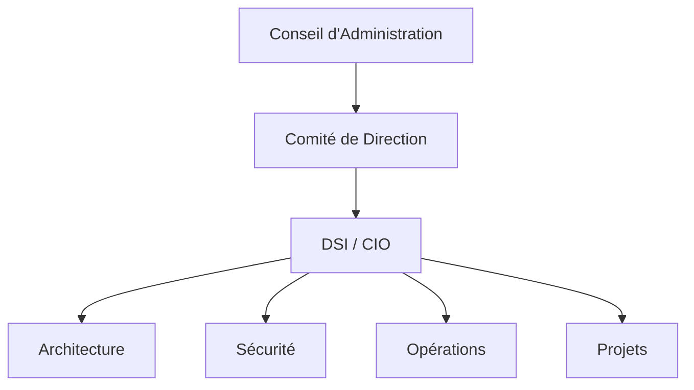

# Concepts clés de la Gouvernance IT

La gouvernance IT (Information Technology Governance) désigne l'ensemble des processus, structures et mécanismes permettant d'aligner les systèmes d'information sur la stratégie de l'entreprise.

## Définition

<Callout type="info">
  **Gouvernance IT** : Ensemble des processus qui garantissent que l'IT soutient les objectifs métier de l'organisation tout en gérant les risques et en optimisant les ressources.
</Callout>

## Les 5 piliers de la Gouvernance IT

<Tabs items={["Alignement", "Valeur", "Risques", "Ressources", "Performance"]}>
  <Tab>
    ### Alignement Stratégique

    Assurer que les investissements IT sont cohérents avec la stratégie d'entreprise.

    - Définition des priorités IT
    - Architecture d'entreprise
    - Portfolio management
  </Tab>
  <Tab>
    ### Création de Valeur

    Maximiser le retour sur investissement des projets IT.

    - Business cases rigoureux
    - Mesure du ROI
    - Optimisation des coûts
  </Tab>
  <Tab>
    ### Gestion des Risques

    Identifier et mitiger les risques liés aux systèmes d'information.

    - Sécurité de l'information
    - Continuité d'activité
    - Conformité réglementaire
  </Tab>
  <Tab>
    ### Gestion des Ressources

    Optimiser l'utilisation des ressources IT (humaines, techniques, financières).

    - Compétences et formation
    - Infrastructure et services
    - Budget IT
  </Tab>
  <Tab>
    ### Mesure de Performance

    Évaluer et améliorer continuellement la performance IT.

    - Tableaux de bord
    - KPIs métier
    - Amélioration continue
  </Tab>
</Tabs>

## Différence entre Gouvernance et Management IT

| Aspect | Gouvernance IT | Management IT |
|--------|----------------|---------------|
| **Focus** | Stratégique | Opérationnel |
| **Responsable** | Direction générale | DSI / CIO |
| **Horizon** | Long terme | Court/moyen terme |
| **Questions** | Quoi et Pourquoi | Comment |
| **Objectif** | Alignement métier | Efficacité opérationnelle |

## Acteurs de la Gouvernance IT

### Rôles et responsabilités

<Steps>
  <Step title="Conseil d'Administration">
    Définit les orientations stratégiques et valide la politique IT.
  </Step>
  <Step title="Direction Générale">
    Assure l'alignement IT-Métier et arbitre les priorités.
  </Step>
  <Step title="DSI / CIO">
    Traduit la stratégie en actions et pilote la performance IT.
  </Step>
  <Step title="Équipes IT">
    Mettent en œuvre les projets et services conformément aux directives.
  </Step>
</Steps>

## Bénéfices de la Gouvernance IT

<CardGrid>
  <Card title="Alignement" icon="target">
    IT aligné sur les objectifs métier
  </Card>
  <Card title="Efficacité" icon="zap">
    Optimisation des ressources et des coûts
  </Card>
  <Card title="Maîtrise" icon="shield">
    Gestion proactive des risques
  </Card>
  <Card title="Agilité" icon="refresh-cw">
    Capacité d'adaptation accrue
  </Card>
</CardGrid>

## Quiz de validation

<Callout type="tip">
  Testez vos connaissances avec le quiz à la fin de ce module pour valider vos acquis.
</Callout>

## Ressources complémentaires

- [ISACA - COBIT Framework](https://www.isaca.org/resources/cobit)
- [ITIL Official Site](https://www.axelos.com/certifications/itil-service-management)
- [ISO/IEC 38500 - IT Governance](https://www.iso.org/standard/62816.html)

---

<DocNavigation
  prev={{ title: "Introduction", href: "/docs/gouvernance-si" }}
  next={{ title: "Enjeux stratégiques", href: "/docs/gouvernance-si/introduction/enjeux-strategiques" }}
/>
